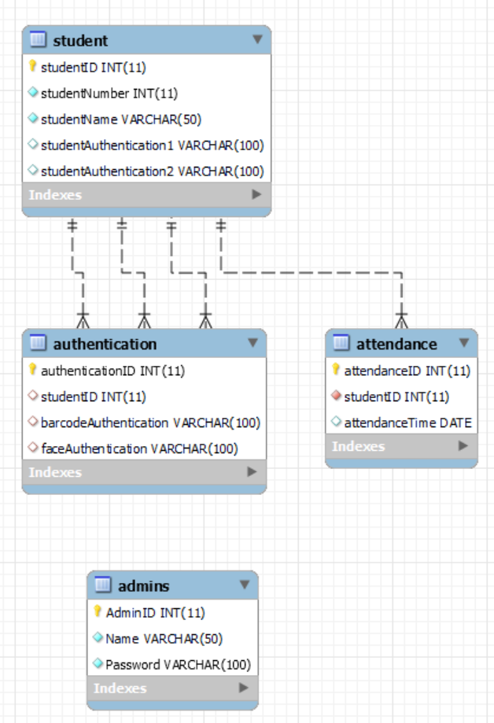

# 데이터베이스 설계서

## 1. 데이터베이스 개요

- 데이터베이스 이름: ProjectDB
- 데이터베이스 관리 시스템: MySQL
- 문자 인코딩: UTF-8

## 2. 테이블 목록

### 2.1. 회원 정보 테이블 (Members)

- 회원 정보를 저장한다.

#### 필드 목록:

- 학생ID (StudentID): 기본 키 (Primary Key), 숫자 (INT)
- 학번 (StudentNumber) : 숫자 (INT),유니크 키 (UNIQUE)
- 이름 (StudentName): 문자열 (VARCHAR), 최대 50자
- 인증정보 (StudentAuthentication1): 문자열 (VARCHAR), 최대 100자
- 인증정보 (StudentAuthentication2): 문자열 (VARCHAR), 최대 100자

| 번호 | 컬럼명                  | 속성명   | 데이터타입 | 길이  | NULL 여부 | KEY | 비고    |
| ---  | ---                    | ---      | ---        | ---   | ---      | --- | ---     |
| 1    | StudentID              | 학생ID   | INT        |       | NOT NULL | PK  |         |
| 2    | StudentNumber          | 학번     | INT        |       | NOT NULL | UK  |         |
| 3    | StudentName            | 이름     | VARCHAR    | 50    | NOT NULL |     |         |
| 4    | StudentAuthentication1 | 인증1    | VARCHAR    | 100   |          |     |         |
| 5    | StudentAuthentication2 | 인증2    | VARCHAR    | 100   |          |     |         |

### 2.2. 출석 테이블 (Attendance)

- 사용자의 출석 및 결석 기록을 저장한다.

#### 필드 목록:

- 출석 ID (AttendanceID): 기본 키 (Primary Key), 숫자 (INT), 자동 증가
- 학생 ID (StudentID): 외래 키 (Foreign Key) - Members 테이블과 연결
- 출석 일자 (AttendanceTime): 날짜 (DATE)

| 번호 | 컬럼명           | 속성명    | 데이터타입 | 길이 | NULL 여부 | KEY  | 비고                 |
| ---  | ---              | ---      | ---        | ---  | ---       | --- | ---                  |
| 1    | AttendanceID     | 출석ID   | VARCHAR    |      | NOT NULL  | PK  | 자동증가              |
| 2    | StudentID        | 학번     | VARCHAR    |      | NOT NULL  | FK  | Members 테이블과 연결 |
| 3    | AttendanceDate   | 출석일자 | DATETIME   |      |           |     |                      |

### 2.3. 인증 테이블 (Authentication)

- 사용자 로그인 세션과 관련된 정보를 저장한다.

#### 필드 목록:

- 인증 ID (authenticationID): 숫자 (INT) ,기본 키 (Primary Key), 자동 증가
- 학생 ID (StudentID): 숫자 (INT), 외래 키(Foreign Key)
- 바코드인식 (barcodeAuthentication): 외래 키 (Foreign Key) - Members 테이블과 연결
- 얼굴인식 (faceAuthentication): 문자열 (VARCHAR), 최대 100자, 외래 키(Foreign Key)

| 번호 | 컬럼명                 | 속성명         | 데이터타입 | 길이 | NULL 여부 | KEY | 비고    |
| ---  | ---                   | ---            | ---        | ---  | ---      | --- | ---     |
| 1    | AuthenticationID      | 인증ID         | INT        |      | NOT NULL | PK  | 자동증가 |
| 2    | studentID             | 학생ID         | INT        |      |          | FK  |          |
| 3    | barcodeAuthentication | 바코드인식     | VARCHAR    | 100  |          | FK  |          |
| 4    | faceAuthentication    | 얼굴인식       | VARCHAR    | 100  |          |     |          |

### 2.4. 관리자 테이블 (Admins)

- 시스템 관리자 정보를 저장한다.

#### 필드 목록:

- 관리자 ID (AdminID): 기본 키 (Primary Key), 자동 증가
- 이름 (Name): 문자열 (VARCHAR), 최대 50자
- 비밀번호 (Password): 문자열 (VARCHAR), 최대 100자, 암호화 저장

| 번호 | 컬럼명     | 속성명   | 데이터타입  | 길이 | NULL 여부 | KEY | 비고       |
| ---  | ---       | ---      | ---         | --- | ---        | ---| ---        |
| 1    | AdminID   | 관리자ID | VARCHAR     | 20  | NOT NULL   | PK | 자동증가    |
| 2    | Name      | 이름     | VARCHAR     | 50  | NULL       |    |            |
| 3    | Password  | 비밀번호 | VARCHAR     | 100 | NULL       |    | 암호화 저장 |

## 3. 테이블 관계

- Members 테이블과 Attendance 테이블은 StudentID 필드를 통해 일대다 관계를 가진다.
- Authentication 테이블은 StudentID 필드를 통해 Members 테이블과 일대다 관계를 가진다.
- Admins 테이블은 관리자 정보를 별도로 관리한다.

    

## 4. 인덱스

- Members 테이블의 StudentID 필드에 고유성을 갖는 인덱스를 생성한다.
- Attendance 테이블의 StudentID 필드에 인덱스를 생성하여 조회 성능을 향상시킨다.

## 5. 보안 고려 사항

- 비밀번호는 해시 함수를 사용하여 저장한다.
- 사용자 세션 토큰은 안전한 방법으로 관리하며, 만료 기간을 설정한다.

## 6. 데이터베이스 백업 정책

- 주기적으로 데이터베이스 백업을 수행한다.
- 백업 데이터는 안전한 저장소에 보관한다.

